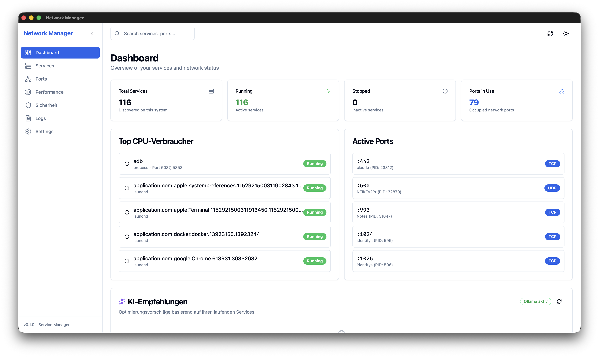
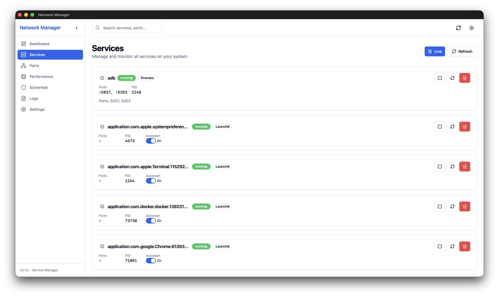
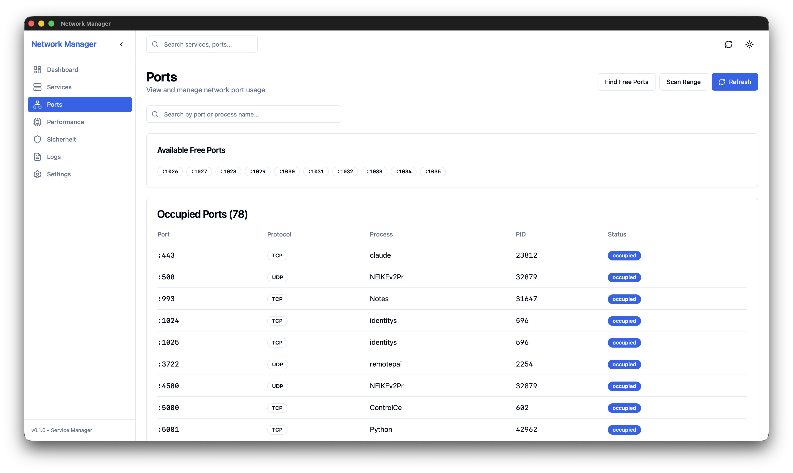
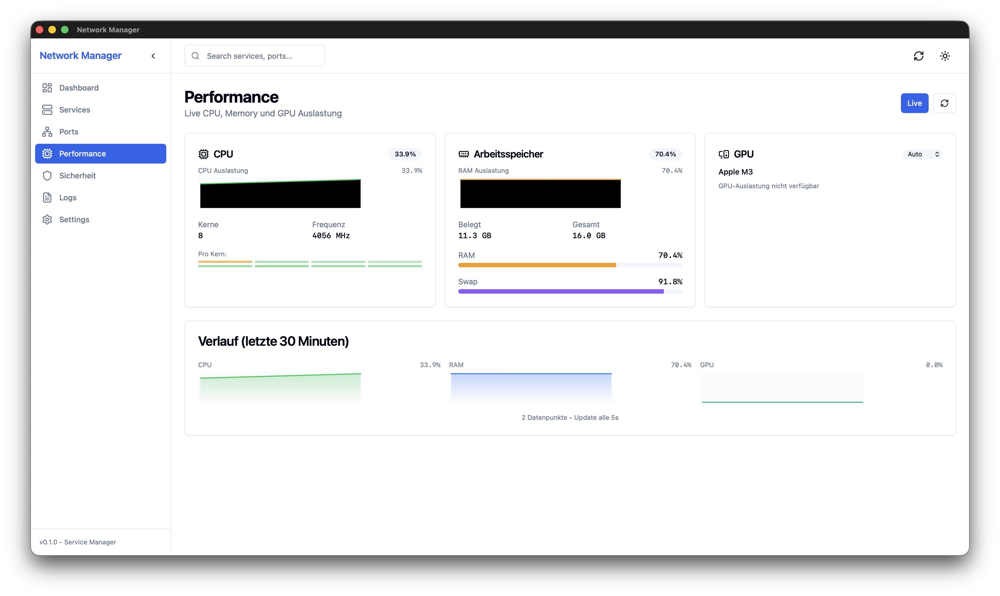
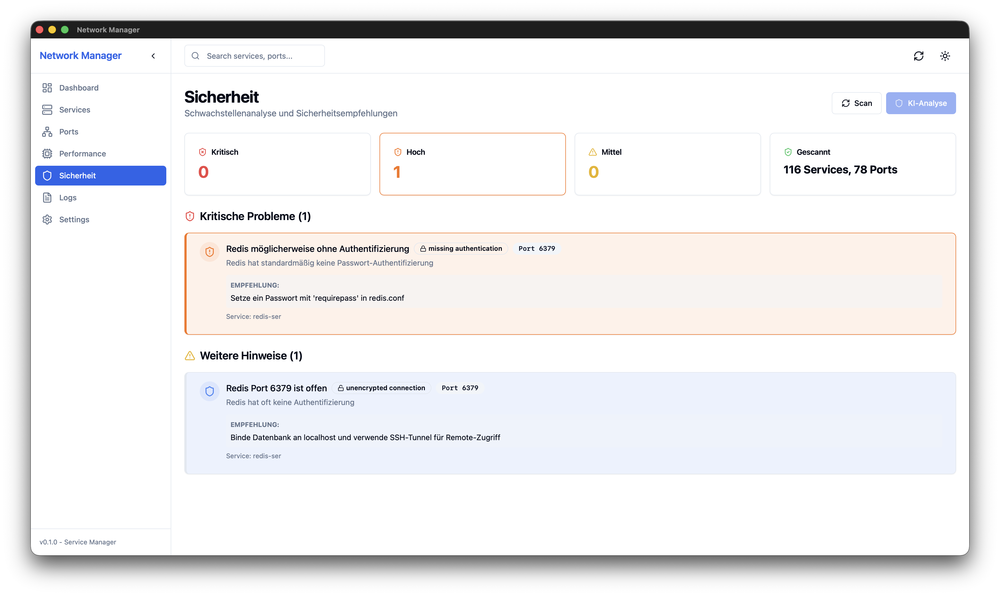

# Network Manager

A cross-platform desktop application for managing services, monitoring system performance, and analyzing security vulnerabilities.

Built with [Tauri](https://tauri.app/) (Rust) + React + TypeScript.



## Features

### Service Management
- **Multi-platform Discovery**: Automatically detects Docker containers, launchd services (macOS), systemd services (Linux), Windows Services, and running processes
- **Service Control**: Start, stop, restart, and kill services with a single click
- **Autostart Toggle**: Enable/disable service autostart directly from the UI
- **Resource Monitoring**: View CPU and memory usage per service



### Port Management
- **Port Scanner**: Scan port ranges to find open/closed ports
- **Process Mapping**: See which process is using which port
- **Free Port Finder**: Quickly find available ports for your applications



### Performance Monitoring
- **Live CPU Monitoring**: Real-time CPU usage with per-core breakdown
- **Memory Tracking**: RAM and swap usage visualization
- **GPU Support**: Monitor Apple Silicon, NVIDIA, and AMD GPUs
- **30-Minute History**: Visual charts showing performance trends



### Security Scanner
- **Vulnerability Detection**: Identifies insecure ports, exposed databases, and misconfigurations
- **Severity Classification**: Issues categorized as Critical, High, Medium, Low, or Info
- **AI-Powered Analysis**: Optional LLM-based security analysis using Ollama
- **Actionable Recommendations**: Clear guidance on how to fix each issue



### AI Integration (Ollama)
- **Process Explanation**: Get AI-powered explanations of what each process does
- **Log Analysis**: Intelligent analysis of service logs
- **Security Insights**: AI-driven security recommendations
- **Local & Private**: All AI processing runs locally via Ollama

## Installation

### Download

Download the latest release for your platform:

| Platform | Download |
|----------|----------|
| macOS (Apple Silicon) | [Network.Manager_x.x.x_aarch64.dmg](https://github.com/ES-92/network_manager/releases/latest) |
| macOS (Intel) | [Network.Manager_x.x.x_x64.dmg](https://github.com/ES-92/network_manager/releases/latest) |
| Windows | [Network.Manager_x.x.x_x64-setup.exe](https://github.com/ES-92/network_manager/releases/latest) |
| Linux (Debian/Ubuntu) | [Network.Manager_x.x.x_amd64.deb](https://github.com/ES-92/network_manager/releases/latest) |
| Linux (Fedora/RHEL) | [Network.Manager_x.x.x.x86_64.rpm](https://github.com/ES-92/network_manager/releases/latest) |
| Linux (AppImage) | [Network.Manager_x.x.x_amd64.AppImage](https://github.com/ES-92/network_manager/releases/latest) |

### Build from Source

```bash
# Clone the repository
git clone https://github.com/ES-92/network_manager.git
cd network_manager

# Install dependencies
npm install

# Run in development mode
npm run tauri dev

# Build for production
npm run tauri build
```

## Requirements

### All Platforms
- For AI features: [Ollama](https://ollama.ai/) running locally with a model like `mistral:7b-instruct`

### macOS
- macOS 10.15 (Catalina) or later
- Xcode Command Line Tools

### Linux
- WebKit2GTK 4.1
- libappindicator3
- librsvg2

```bash
# Ubuntu/Debian
sudo apt install libwebkit2gtk-4.1-dev libappindicator3-dev librsvg2-dev

# Fedora
sudo dnf install webkit2gtk4.1-devel libappindicator-gtk3-devel librsvg2-devel
```

### Windows
- Windows 10 or later
- WebView2 (usually pre-installed)

## Usage

### Dashboard
The dashboard provides a quick overview of all running services, resource usage, and recent activity.

### Services Tab
View and manage all detected services. Click on a service to see details, or use the action buttons to control it.

### Ports Tab
Scan for open ports and see which processes are using them. Use the "Find Free Ports" feature to locate available ports.

### Performance Tab
Monitor system resources in real-time. The charts show 30 minutes of history with 5-second update intervals.

### Security Tab
Run security scans to identify potential vulnerabilities. Click "KI-Analyse" for AI-powered security insights (requires Ollama).

### Settings Tab
Configure theme (light/dark/system), refresh intervals, and Ollama connection settings.

## Tech Stack

### Backend (Rust)
- **Tauri 2.0**: Cross-platform application framework
- **Bollard**: Docker API client
- **sysinfo**: System information gathering
- **reqwest**: HTTP client for Ollama API
- **SQLx**: SQLite for audit logging
- **ChaCha20Poly1305**: Encryption for sensitive config

### Frontend (React + TypeScript)
- **React 18**: UI framework
- **shadcn/ui**: Beautiful UI components
- **Tailwind CSS**: Utility-first styling
- **Zustand**: State management
- **Lucide**: Icon library

## Project Structure

```
network_manager/
├── src/                    # React frontend
│   ├── components/         # UI components
│   ├── pages/              # Page components
│   ├── stores/             # Zustand stores
│   └── lib/                # Utilities and Tauri bindings
├── src-tauri/              # Rust backend
│   ├── src/
│   │   ├── commands/       # Tauri command handlers
│   │   ├── services/       # Business logic
│   │   │   ├── discovery/  # Service discovery
│   │   │   ├── control/    # Service control
│   │   │   ├── port/       # Port scanning
│   │   │   └── security/   # Security features
│   │   ├── models/         # Data models
│   │   └── llm/            # Ollama integration
│   └── Cargo.toml
└── package.json
```

## Contributing

Contributions are welcome! Please feel free to submit a Pull Request.

## License

MIT License - see [LICENSE](LICENSE) for details.

## Acknowledgments

- [Tauri](https://tauri.app/) - For the amazing cross-platform framework
- [shadcn/ui](https://ui.shadcn.com/) - For beautiful UI components
- [Ollama](https://ollama.ai/) - For local AI capabilities
